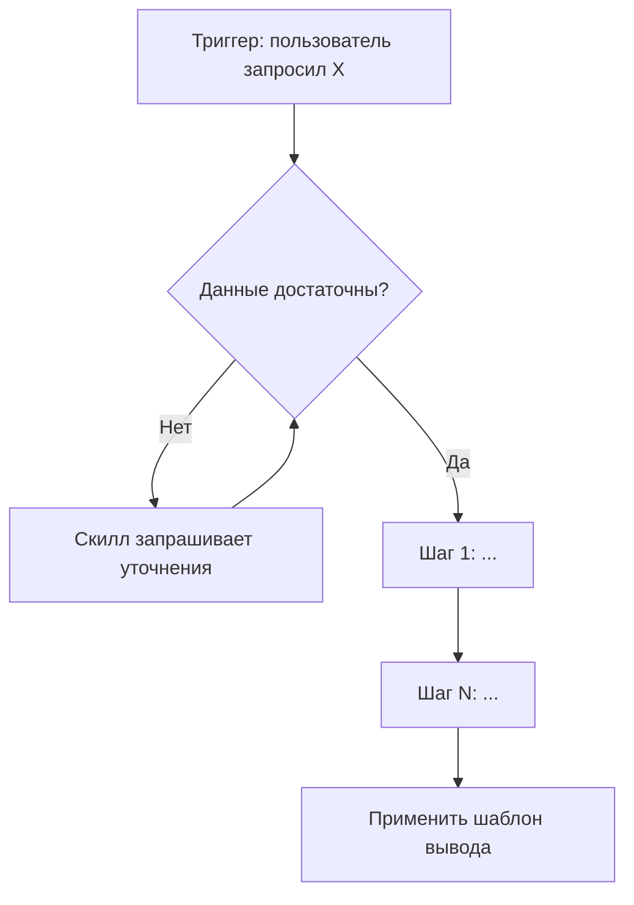

# Протокол: Фазы 1–2

## Фаза 1: ГЛУБОКОЕ БУРЕНИЕ (Discovery)

Цель — понять задачу для проектирования скилла.

### Алгоритм

1. Прочитай материалы пользователя (ТЗ, промпты, примеры) через Read
2. Задай уточняющие вопросы (адаптируй, не спрашивай очевидное):
   - **Задача:** «Какую задачу решает скилл? 2–3 сценария.»
   - **Триггеры:** «Что пользователь скажет, чтобы скилл активировался? А что НЕ должно его вызывать?»
   - **Формат вывода:** «Нужен ли жёсткий шаблон результата?»
   - **Инструменты:** «Какие tools нужны скиллу? (Read, Write, Bash, Grep, Agent, WebFetch, MCP)»
   - **Ресурсы:** «Есть ли материалы для включения в references?»
3. Если задача пришла из диалога («сделай из этого скилл»), извлеки ответы из истории

Не переходи к Фазе 2 без ответов минимум на вопросы 1–3.

---

## Фаза 2: ЛОГИЧЕСКАЯ АРХИТЕКТУРА (Blueprint)

### 2.1 Выбор паттерна

См. `references/patterns.md`. Краткая таблица:

| Паттерн | Когда | Свобода |
|---------|-------|---------|
| Sequential Workflow | Пошаговый процесс | Низкая |
| Iterative Refinement | Циклическое улучшение | Средняя |
| Context-Aware Selection | Разные инструменты по контексту | Средняя |
| Domain Intelligence | Специализированные знания | Низкая–Средняя |
| Multi-MCP Coordination | Несколько внешних сервисов | Низкая |

### 2.2 Визуализация

Mermaid-диаграмма логики *будущего скилла* (не текущей задачи!):



### 2.3 Архитектура директории

```
skill-name/
├── SKILL.md              # Мозг (≤ 100 строк)
├── references/           # Детали (загружается по требованию)
├── scripts/              # Скрипты (исполняются, не загружаются)
├── examples/             # Примеры
└── assets/               # Шаблоны для вывода (не загружаются)
```

Спроси: **«Архитектура верна? Приступаю к сборке?»**
